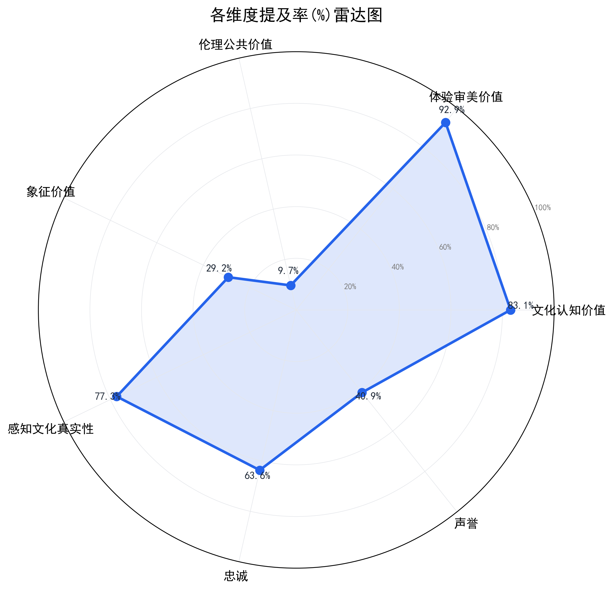
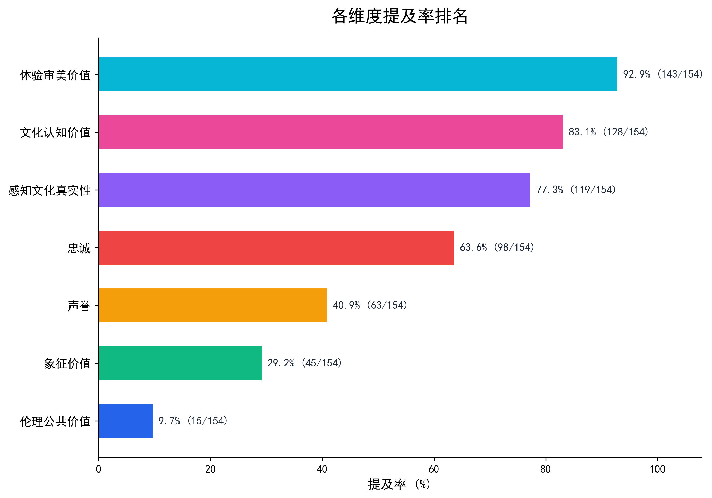
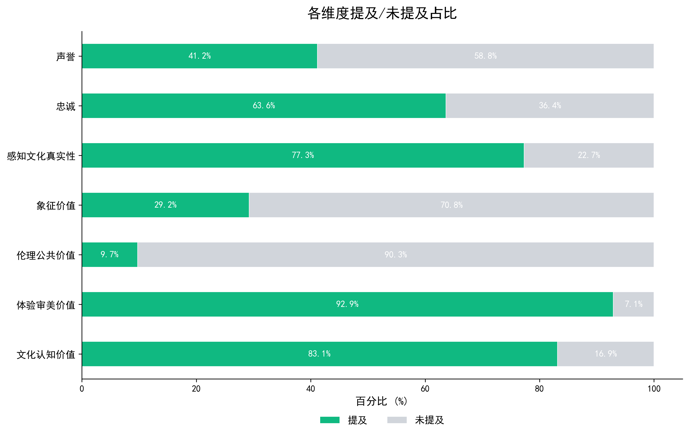
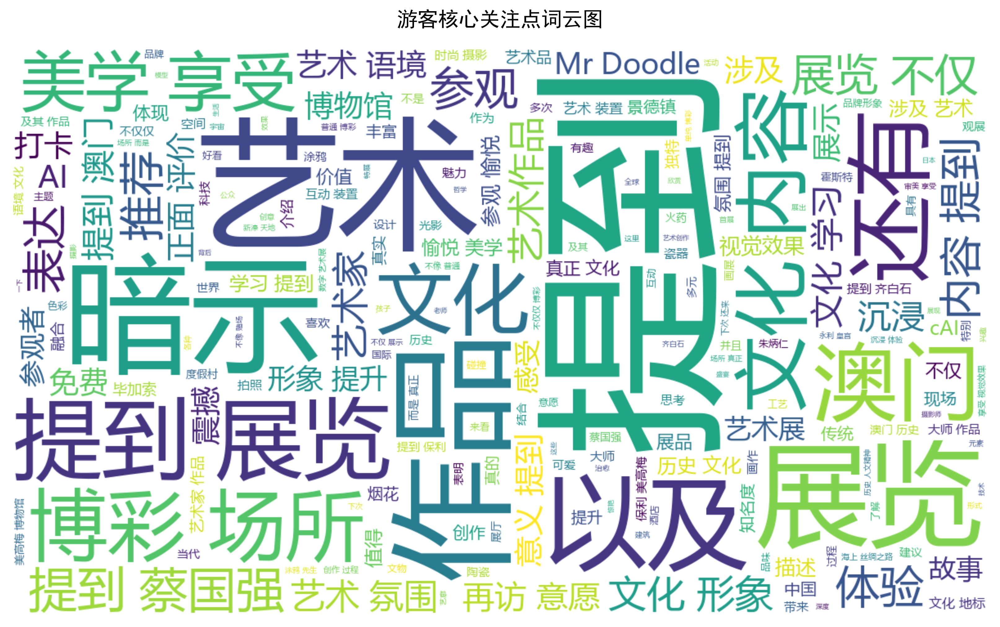
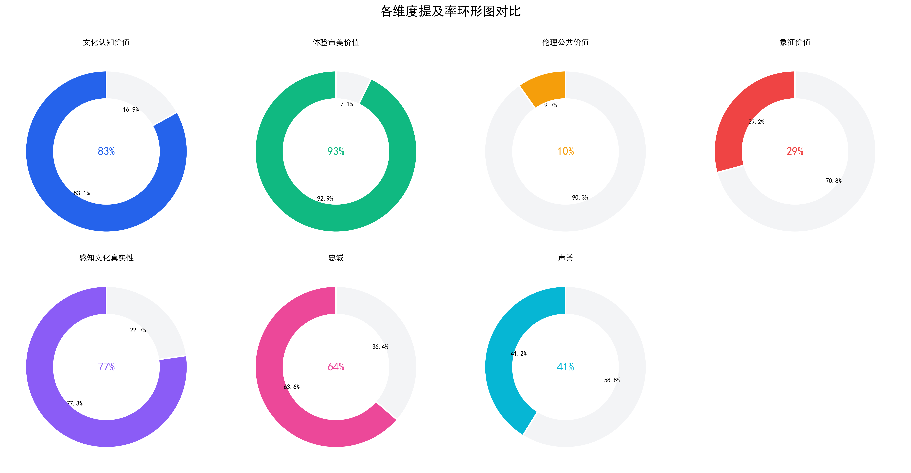
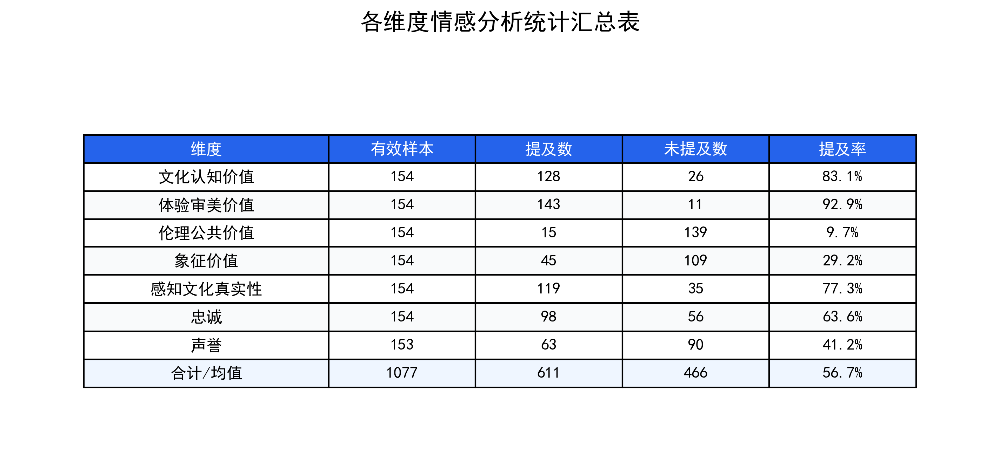
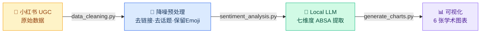

<h1 align="center">🇲🇴 Macau Exhibition UGC Sentiment Analysis Pipeline</h1>

<p align="center">
  <strong>基于本地大语言模型，针对澳门展览小红书 UGC 文本的多维度方面级情感分析（ABSA）与可视化流水线。</strong>
</p>

<p align="center">
  
  
  
  
  
  
</p>

---

## ✨ 核心特性

- 🤖 **全本地化推理** — 基于 Ollama + Qwen 2.5，数据不离开本机，零 API 费用
- 📐 **七维度 ABSA** — 文化认知 · 体验审美 · 伦理公共 · 象征价值 · 文化真实性 · 忠诚 · 声誉
- 🧹 **小红书深度降噪** — 去链接 / 去话题 / 压缩空白，**强制保留 Emoji**，500 字 Token 截断
- 🛡 **网络劫持绕过** — `127.0.0.1` 替代 localhost + `NO_PROXY` 环境变量，彻底规避代理软件 502
- 🧬 **正则防 JSON 幻觉** — `temperature=0.1` 降噪 + Regex 贪婪匹配 `r'\{[\s\S]*\}'` 强抠 JSON + 中文标点自动修复 + 3 次重试自愈
- 💾 **Checkpoint 断点续传** — 每 10 条自动存档，tqdm 实时进度，崩溃可续跑
- 📊 **6 张学术级图表** — 雷达图 · 排名图 · 堆叠柱状图 · 词云 · 环形图 · 统计汇总表，一键生成

---

## 🚀 快速开始

### 1. 环境准备

```bash
# 安装 Ollama → https://ollama.com/
ollama pull qwen2.5:7b

# 安装 Python 依赖
pip install pandas openpyxl ollama httpx tqdm matplotlib wordcloud jieba
```

### 2. 三步运行

```bash
python data_cleaning.py          # Step 1 — 小红书 UGC 降噪清洗
python sentiment_analysis.py     # Step 2 — LLM 七维度情感提取
python generate_charts.py        # Step 3 — 生成 6 张可视化图表
```

### 3. 项目结构

```
Macau_Sentiment_Analysis/
├── data_cleaning.py          # 数据降噪清洗
├── sentiment_analysis.py     # LLM 情感提取主程序
├── generate_charts.py        # 图表生成
├── test_connection.py        # Ollama 连接诊断
├── debug_output.py           # 模型输出调试
├── sample_data.xlsx          # 脱敏样本数据
├── assets/                   # 生成的可视化图表
├── Local/                    # ⛔ .gitignore 保护，不上传
└── README.md
```

---

## 📊 可视化成果展示

<table>
  <tr>
    <td align="center">
      
      <br/><b>七维综合表现雷达图</b>
    </td>
    <td align="center">
      
      <br/><b>各维度提及率排名</b>
    </td>
  </tr>
  <tr>
    <td align="center">
      
      <br/><b>提及/未提及占比分布</b>
    </td>
    <td align="center">
      
      <br/><b>核心关注点词云图 (Jieba)</b>
    </td>
  </tr>
  <tr>
    <td align="center">
      
      <br/><b>多维度环形图对比</b>
    </td>
    <td align="center">
      
      <br/><b>统计汇总表</b>
    </td>
  </tr>
</table>

---

## 🔄 架构与流程



### 七大分析维度

| # | 维度 | 关注焦点 |
|:-:|:-----|:---------|
| 1 | 文化认知价值 | 澳门文化、本地历史、艺术语境、社会意义 |
| 2 | 体验审美价值 | 参观愉悦、震撼感、沉浸式体验、视觉效果 |
| 3 | 伦理公共价值 | 免费开放、公益、社会责任、文化普及 |
| 4 | 象征价值 | 品牌文化形象、高端定位、文化地标 |
| 5 | 感知文化真实性 | 度假村的真正文化内容、艺术氛围 |
| 6 | 忠诚 | 再访意愿、推荐朋友、种草打卡 |
| 7 | 声誉 | 品牌整体评价、口碑、知名度 |

---

## 🧹 数据预处理

小红书 UGC 噪音极大。[`data_cleaning.py`](data_cleaning.py) 实现了定制化降噪：去除 URL、`@提及`、`#话题标签#`，压缩连续空白，**强制保留 Emoji**，最终截断至 500 字以控制推理成本。

<details>
<summary>🔍 点击展开查看：数据清洗前后直观对比</summary>

<br/>

| 清洗操作 | 实现方式 |
|:---------|:---------|
| 去除 URL | `re.sub(r'http[s]?://\S+', '')` |
| 去除 @提及 | `re.sub(r'@[^\s]+', '')` |
| 去除末尾话题 | `re.sub(r'(#\S+\s*)+$', '')` |
| 剥离行内 `#` | `text.replace('#', '')` |
| 压缩空白 | 多余换行 & 空格合并 |
| **保留 Emoji** | 仅移除不可见控制字符 |
| Token 截断 | 前 500 字符硬截断 |

<table>
<tr>
<th width="50%">🔴 原始 UGC 数据 (Raw)</th>
<th width="50%">🟢 清洗后传入大模型 (Cleaned)</th>
</tr>
<tr>
<td>

```text
🎉宝妈们，最近带娃去了澳门美高梅的保利美
高梅博物馆，看了它的兽展"蓝色飘带——探索
神秘海域 邂逅丝路遗珍"，真的太赞了，必须
给大家分享！

🎫关于yu约和现场取票：这个展可以提前在网
上预约，当然现场排队取票也没问题。

🌟这个展览以海上丝绸之路为主题，有184组
228件文物及艺术品呢。

🎈一进入"季风"展区，就像是打开了海洋文
明的历史画卷。

📿接着是"文脉"展区……

🐮"交织"展区可是亮点十足哦！

🌊最后是"联结"展区……

✨展览的科技感也很强哦！

📍地址就在澳门美高梅二楼，免费入场哦！
```

</td>
<td>

```text
🎉宝妈们，最近带娃去了澳门美高梅的保利美高
梅博物馆，看了它的兽展"蓝色飘带——探索神秘
海域 邂逅丝路遗珍"，真的太赞了，必须给大家
分享！🎫关于yu约和现场取票：这个展可以提前在
网上预约，当然现场排队取票也没问题。虽说现场
取票方便，但也吸引了很多客人去看，要是赶上节
假日，还是建议提前预约，避免等待时间过长~🌟
这个展览以海上丝绸之路为主题，有184组228件文
物及艺术品呢。整个展览按照时间脉络，分为四个
主题空间，能让孩子们全面了解海上丝绸之路的过
去、现在和未来。🎈一进入"季风"展区，就像是
打开了海洋文明的历史画卷。这里以宏观视角，讲
述了人类从敬畏海洋到利用海洋开启航海探索世界
的过程。📿接着是"文脉"展区，这里以水下考古
为线索，通过沉船、出水文物、古港遗迹等...
```

> ✅ Emoji 全部保留 · 换行压缩为连续文本 · 超 500 字自动截断

</td>
</tr>
</table>

</details>

---

## 📦 样本数据

> 全量原始数据存放于 `.gitignore` 保护的 `Local/` 目录中，**不会上传至 GitHub**。
> 仓库仅提供脱敏后的 [`sample_data.xlsx`](sample_data.xlsx) 供格式参考与功能验证。

| original_text | cleaned_text | 文化认知价值_情感极性 | 文化认知价值_判定原因提取 | … | 声誉_情感极性 | 声誉_判定原因提取 |
|:---|:---|:---:|:---|:---:|:---:|:---|
| 原始笔记全文 | 清洗后文本 | 提及 / 未提及 | 摘要原因 | … | 提及 / 未提及 | 摘要原因 |

> 每条 UGC 对应 **7 维度 × 2 字段（极性 + 原因）= 14 列**，加上原始文本与清洗文本共 **16+ 列**。

---

## 💻 硬件与性能

### 开发环境

| 组件 | 规格 |
|:---:|:---:|
| CPU | Intel Core i5-12600KF |
| GPU | NVIDIA GeForce RTX 3070 Ti (8 GB VRAM) |
| RAM | 32 GB DDR4 |
| OS  | Windows 11 |

### 显存需求参考

| 档位 | 参数量 | 预估显存 | 代表模型 | 备注 |
|:---:|:------:|:--------:|:---------|:-----|
| **Tiny** | < 4.5B | ~ 3 – 4 GB | Qwen 3.5 : 4B, Phi-3 Mini | ✅ 本项目实测可用 |
| **Small** | 4.5 – 14B | 6 – 10 GB | Qwen 2.5 : 7B, Llama 3 : 8B | ✅ **本项目主力模型** |
| **Medium** | 14 – 70B | 12 – 48 GB | Qwen 2.5 : 32B, Llama 3 : 70B | 需 RTX 4090 / A6000 |
| **Large** | > 70B | 48 GB+ | Llama 3 : 405B, DeepSeek-V2 | 需多卡 / 专业级 GPU |

### 技术栈

| 层级 | 技术 | 用途 |
|:---:|:-----|:-----|
| LLM 引擎 | [Ollama](https://ollama.com/) | 本地 LLM 部署与 API 服务 |
| 语言模型 | Qwen 2.5 : 7B | 七维度 ABSA 情感提取 |
| 数据处理 | Pandas | 清洗、转换、I/O |
| 中文分词 | Jieba | 词云图分词 |
| 可视化 | Matplotlib · WordCloud | 学术级图表生成 |
| 网络层 | httpx | 自定义超时与代理绕过 |

---

## ⚠ 免责声明

1. 本项目代码及分析流程**仅供学术研究与工程技术交流**，不构成任何商业建议。
2. 全量 UGC 数据涉及用户隐私，已通过 `.gitignore` 严格保护，**不会上传至公开仓库**。
3. 情感分析结果由本地大语言模型自动生成，可能存在误判或遗漏，**不代表任何官方立场**。
4. 如有数据或版权争议，请联系仓库维护者，将第一时间处理。

---

<p align="center">
  <sub>Built with 🧠 Local LLM · 🐍 Python · 📊 Matplotlib &nbsp;|&nbsp; Made in Macau 🇲🇴</sub>
</p>
